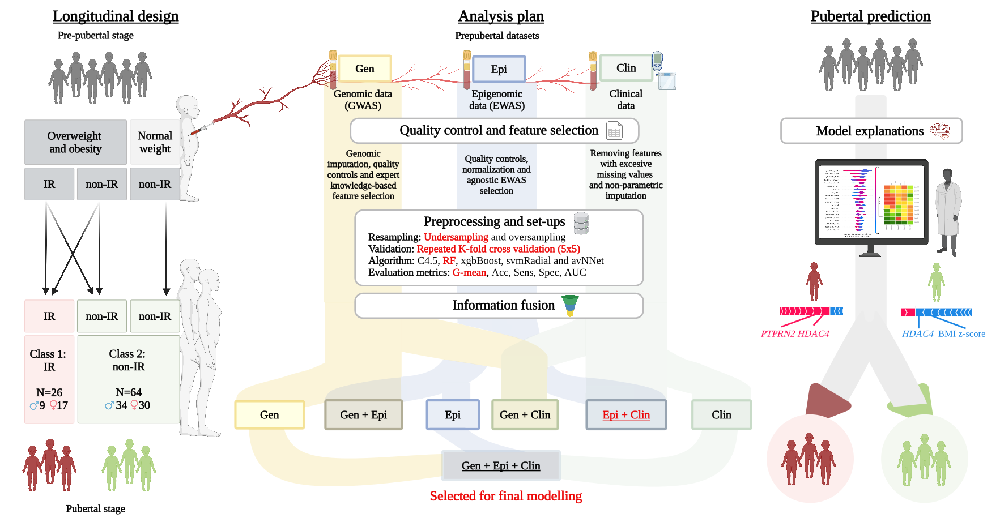
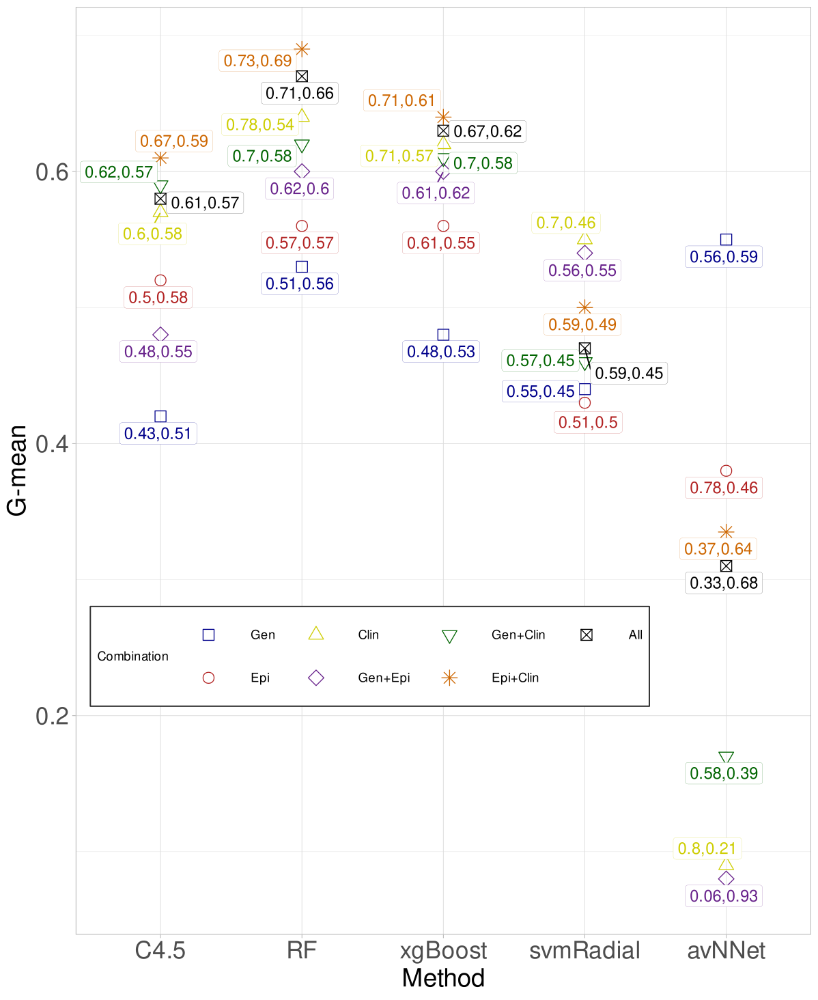
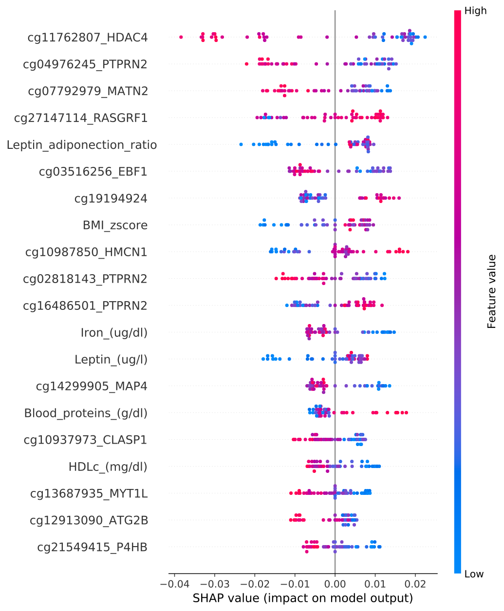
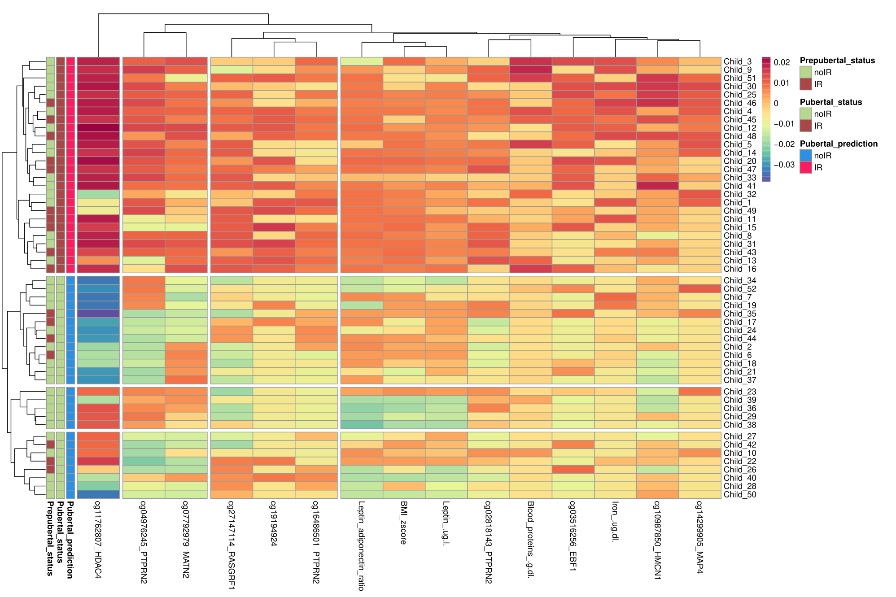

# Multiomics and eXplainable artificial intelligence for decision support in insulin resistance early diagnosis: A pediatric population-based longitudinal study

## Authors
by 
Álvaro Torres-Martos,
Augusto Anguita-Ruiz,
Mireia Bustos Aibar, 
Alberto Ramírez Mena, 
María Arteaga, 
Gloria Bueno, 
Rosaura Leis, 
Concepción M. Aguilera, 
Rafael Alcalá, 
Jesús Alcalá-Fdez

> This is an online repository gathering all codes employed for the analyses presented in the paper (Torres-Martos Á *et al*. Multiomics and eXplainable Artificial Intelligence for decision support in insulin resistance early diagnosis: A pediatric population-based longitudinal study". *Artificial Intelligence in Medicine*. 2024.;156:102962. doi:10.1016/j.artmed.2024.102962). The purpose of this repository is to allow researchers to reproduce the Machine Learning pipeline presented in the paper, as well as to adapt provided codes for the analyses of their own datasets.

> In the current paper, we propose a Machine Learning pipeline integrating multiomics data and eXplainable Artificial Intelligence (XAI) to predict insulin resistance during puberty using only pre-pubertal information. The methodology, including the combination of data layers, algorithms, and resampling techniques, is summarized in the following figure:

<div align="center">
  
  <p><strong>Figure 1.</strong> Summary of the experimental design. The longitudinal study consisted of pre-pubertal children who were followed into puberty three years later. The pre-pubertal information was used as input to generate the classifiers and the output was the pubertal IR status. The analysis plan utilizes genomic (Gen), epigenomic (Epi), and clinical (Clin) data from pre-pubertal children. The chosen data combination, algorithm, and resampling method are highlighted in red. Subsequently, we made pubertal predictions and analyzed the final classifier’s behavior using post-hoc explainer.</p>
</div>

The manuscript is open access, and both the main article and supplementary material can be freely accessed through the following links:

- **Main Article**:
  - **Journal Website**: [https://www.sciencedirect.com/science/article/pii/S0933365724002045](https://www.sciencedirect.com/science/article/pii/S0933365724002045)
  - **University of Granada Institutional Repository (DIGIBUG)**: [https://digibug.ugr.es/handle/10481/93775](https://digibug.ugr.es/handle/10481/93775)

- **Supplementary Material**:
  - **UGR MultiOmics IR Prediction Website**: [https://sci2s.ugr.es/MultiOmics_IR_Pred](https://sci2s.ugr.es/MultiOmics_IR_Pred)

This open-source repository is shared with the goal of promoting transparency and reproducibility in research, allowing researchers to reproduce the results and adapt the provided pipeline for their own datasets.

## Abstract 

> Pediatric obesity can drastically heighten the risk of cardiometabolic alterations later in life, with insulin resistance standing as the cornerstone linking adiposity to the increased cardiovascular risk. Puberty has been pointed out as a critical stage after which obesity-associated insulin resistance is more difficult to revert. Timely prediction of insulin resistance in pediatric obesity is therefore vital for mitigating the risk of its associated comorbidities. The construction of effective and robust predictive systems for a complex health outcome like insulin resistance during the early stages of life demands the adoption of longitudinal designs for more causal inferences, and the integration of factors of varying nature involved in its onset. In this work, we propose an eXplainable Artificial Intelligence-based decision support pipeline for early diagnosis of insulin resistance in a longitudinal cohort of 90 children. For that, we leverage multi-omics (genomics and epigenomics) and clinical data from the pre-pubertal stage. Different data layers combinations, pre-processing techniques (missing values, feature selection, class imbalance, etc.), algorithms, training procedures were considered following good practices for Machine Learning. SHapley Additive exPlanations were provided for specialists to understand both the decision-making mechanisms of the system and the impact of the features on each automatic decision, an essential issue in high-risk areas such as this one where system decisions may affect people's lives. The system showed a relevant predictive ability (AUC and G-mean of 0.92). A deep exploration, both at the global and the local level, revealed promising biomarkers of insulin resistance in our population, highlighting classical markers, such as Body Mass Index z-score or leptin/adiponectin ratio, and novel ones such as methylation patterns of relevant genes, such as *HDAC4*, *PTPRN2*, *MATN2*, *RASGRF1* and *EBF1*. Our findings highlight the importance of integrating multi-omics data and following eXplainable Artificial Intelligence trends when building decision support systems. 

## Results 

<div align="center">
  <table>
    <tr>
      <td>
        
      </td>
      <td>
        
      </td>
    </tr>
  </table>
  <p><strong>Figure 2 and 3.</strong> (Left) G-mean is shown on the y-axis and sensitivity and specificity are shown in the label for the employed classifiers across the combinations of data layers. (Right) The SHAP analysis was conducted for our final system (RF) to provide global explanations. The top 20 features are ranked by their contributions. Each point represents the contribution of a specific child and feature to the system, with colors indicating feature values.</p>
</div>


<div align="center">
  
  <p><strong>Figure 4.</strong> The heatmap displays clusters of children (rows) and variables (columns) based on their SHAP values. Clustering was only performed on the children used to generate the final classifier (RF) and the fifteen variables that contributed the most to the system based on their SHAP values. The legend shows that red and green represent children who were in IR and non-IR in pre-pubertal and pubertal states, respectively. Blue and red represent the non-IR and IR predictions of RF, respectively. The identification number of each child is displayed on the right-hand side. The visualization displays four clusters of children and variables. The initial cluster of variables comprises solely HDAC4 methylation, while the following two clusters consist of methylation of the main genes and the last cluster of variables comprises clinical variables such as BMI z-score and leptin/adiponectin ratio together with other methylation patterns. The first, second, third, and fourth clusters of children are composed of the following individuals with IDs from child 3 to child 16, from child 34 to child 37, from child 23 to child 38 and from child 27 to child 50, respectively It is worth noting that the first and second clusters of children can be distinguished by their HDAC4 methylation pattern, while the last two clusters are characterized by their heterogeneity.</p>
</div>

## Getting the code

All source code used to generate the results in the paper is organized in the `scripts` folder. This folder is further structured into subdirectories based on the specific tasks performed in the study. Each subdirectory corresponds to a key step in the pipeline described in the manuscript, allowing researchers to easily navigate and reproduce the analysis. Each subdirectory contains well-documented scripts that correspond to specific steps in the analysis pipeline, making it easy to adapt the methodology to other datasets or contexts.


You can download a copy of all the files in this repository by cloning the
[git](https://git-scm.com/) repository:

    git clone https://github.com/AlvaroTorresMartos/IR_prediction

or [download a zip archive](https://github.com/AlvaroTorresMartos/IR_prediction/archive/refs/heads/master.zip).


## Dependencies

A `R/Python` environment is required to execute the code. The required libraries for each analysis are specified in each script. Several command line tools have been utilized through the shell, including `vcftools`, `bcftools`, and `PLINK`.


## License

All source code is made available under a BSD 3-clause license. You can freely use, modify, and distribute the code, provided proper attribution is given to the authors. See `LICENSE.md` for the full license text. 


## Citation

If this work or the code provided in this repository has contributed to your research, we kindly ask that you cite our work in your publications. Proper citation helps acknowledge the efforts behind this project and supports further development.

Please use the following citation:

**Torres-Martos, Á., Anguita-Ruiz, A., Bustos-Aibar, M., Ramírez-Mena, A., Arteaga, M., Bueno, G., Leis, R., Aguilera, C. M., Alcalá, R., & Alcalá-Fdez, J. (2024). Multiomics and eXplainable artificial intelligence for decision support in insulin resistance early diagnosis: A pediatric population-based longitudinal study. Artificial intelligence in medicine, 156, 102962. [https://doi.org/10.1016/j.artmed.2024.102962](https://doi.org/10.1016/j.artmed.2024.102962)**

Alternatively, you can use the following BibTeX entry for your reference manager:

```bibtex
@article{TorresMartos2024,
  title = {Multiomics and eXplainable artificial intelligence for decision support in insulin resistance early diagnosis: A pediatric population-based longitudinal study},
  volume = {156},
  ISSN = {0933-3657},
  url = {http://dx.doi.org/10.1016/j.artmed.2024.102962},
  DOI = {10.1016/j.artmed.2024.102962},
  journal = {Artificial Intelligence in Medicine},
  publisher = {Elsevier BV},
  author = {Torres-Martos, Álvaro and Anguita-Ruiz, Augusto and Bustos-Aibar, Mireia and Ramírez-Mena, Alberto and Arteaga, María and Bueno, Gloria and Leis, Rosaura and Aguilera, Concepción M. and Alcalá, Rafael and Alcalá-Fdez, Jesús},
  year = {2024},
  month = oct,
  pages = {102962}
}
```

We deeply appreciate your acknowledgment, as it helps highlight the importance of open science and supports the research community.
